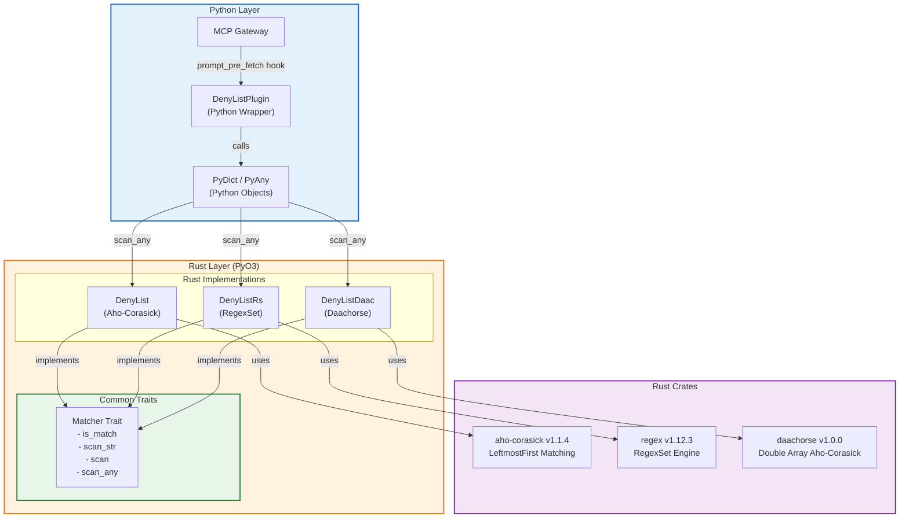
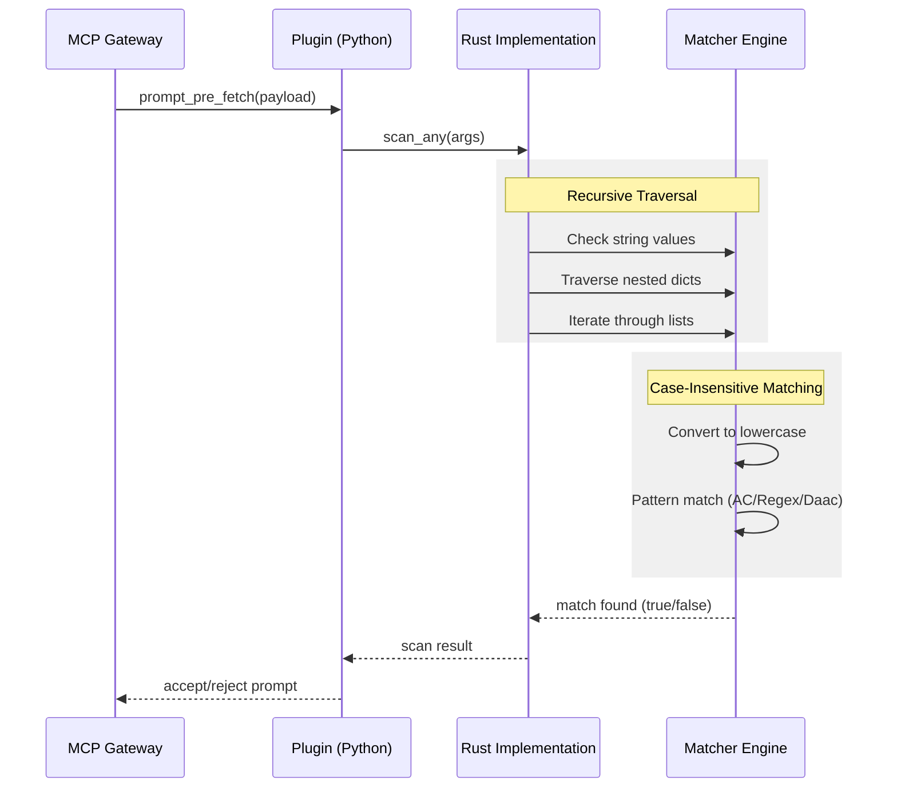

# Deny Words Plugin

A high-performance deny list filtering plugin for MCP Gateway that detects prohibited words in prompts. This plugin provides both Python and Rust
implementations, with the Rust version offering significant performance improvements through efficient pattern matching algorithms.

## Overview

The Deny Words Plugin scans incoming prompts for prohibited words or phrases before they are processed. When a deny word is detected, the plugin
rejects the prompt request, providing an additional security layer for your MCP Gateway deployment.

## Architecture

The following diagram illustrates the plugin architecture, showing the relationship between Python bindings and Rust implementations:



### Architecture Components

**Python Layer:**
- **MCP Gateway**: The main gateway that triggers the plugin via `prompt_pre_fetch` hook
- **DenyListPlugin**: Python wrapper that interfaces with Rust implementations
- **PyDict / PyAny**: Python objects containing prompt data to be scanned

**Rust Layer (PyO3):**
- **DenyList**: Uses Aho-Corasick algorithm for efficient multi-pattern string matching
- **DenyListRs**: Uses RegexSet for regex-based pattern matching
- **DenyListDaac**: Uses Double Array Aho-Corasick for memory-efficient matching
- **Matcher Trait**: Common interface defining `is_match`, `scan_str`, `scan`, and `scan_any` methods

**Rust Crates:**
- **aho-corasick**: Fast multi-pattern matching with LeftmostFirst semantics
- **regex**: RegexSet engine for compiling and matching multiple patterns
- **daachorse**: Double Array Aho-Corasick for compact and fast matching

### Data Flow



## Key Features

- **Fast Pattern Matching**: Rust implementation uses optimized pattern-matching algorithms for efficient word detection
- **Multiple Implementation Options**:
    - `deny.DenyListPlugin` - Pure Python, easy to debug, good for small word lists
    - `deny_rust.DenyListPluginRust` - Python with Rust bindings (aho-corasick crate)
    - `deny_rust_rs.DenyListPluginRustRs` - Python with Rust bindings (regex crate - RegexSet)
    - `deny_rust_daac.DenyListPluginDaac` - Python with Rust bindings (daachorse crate)
- **Configurable Deny Lists**: Support for multiple deny word lists with different priorities
- **Pre-Hook Integration**: Operates at the `prompt_pre_fetch` hook stage
- **Comprehensive Testing**: Includes benchmark tests demonstrating performance characteristics
- **Case-Insensitive Matching**: All implementations normalize input to lowercase for matching
- **Deep Traversal**: Recursively scans nested dictionaries and lists

## Previous Python Implementation (`deny.py`)

The original `deny.DenyListPlugin` has the following limitations:

- **No nested structure traversal**: Only checks top-level string values in `payload.args`; does not recurse into nested dicts or lists
- **Case-sensitive matching**: Does not normalize deny words or input strings to lowercase/uppercase, requiring exact case matches
- **Flat iteration**: Uses simple `any(word in payload.args[key] for word in self._deny_list)` without deep traversal

The Rust implementations address these limitations with:
- **Case-insensitive matching**: All input is normalized to lowercase before matching
- **Deep recursive traversal**: The `scan_any` method recursively processes nested dicts and lists
- **Type safety**: PyO3 ensures safe conversion between Python and Rust types
- **Multiple algorithms**: Choose from Aho-Corasick, RegexSet, or Daachorse based on your needs

## Performance Benefits

The Rust implementation provides substantial performance improvements over pure Python:

### Benchmark Results

Run benchmarks with:
```bash
uv run pytest -s -v tests/test_benchmark_comparison.py
```

### Performance Comparison

> **Note:** The benchmark table below was generated with pytest on . 
> To regenerate manually, run:
> ```bash
> uv run pytest -s -v tests/test_benchmark_comparison.py
> ```
> The Markdown table output will be printed to stdout.
> 

AMD EPYC 7763 64-Core:

<!-- BENCHMARK_TABLE_START -->
| Config<br>Size | DenyListPlugin<br>Median | DenyListPluginRustRs<br>Median | Speedup | DenyListPluginRust<br>Median | Speedup |
| :---------- | :--------------- | :------------------ | :--------- | :------------------ | :--------- |
| 10          |          16.39μs |           3.66μs |     4.48x |           3.61μs |     4.54x |
| 100         |         709.86μs |          25.13μs |    28.25x |          10.00μs |    71.02x |
| 200         |        1547.06μs |          26.20μs |    59.06x |          36.27μs |    42.66x |
<!-- BENCHMARK_TABLE_END  -->

12th Gen Intel(R) Core(TM) i5-12500H:

| Config<br>Size | DenyListPlugin<br>Median | DenyListPluginRustRs<br>Median | Speedup | DenyListPluginRust<br>Median | Speedup |
| :---------- | :--------------- | :------------------ | :--------- | :------------------ | :--------- |
| 10          |           7.60μs |           2.01μs |     3.78x |           1.96μs |     3.87x |
| 100         |         555.88μs |          16.06μs |    34.61x |           5.42μs |   102.66x |
| 200         |        1225.23μs |          16.91μs |    72.46x |          18.08μs |    67.77x |


**Key Findings:**
- Both Rust implementations are consistently faster across all configuration sizes
- DenyListPluginRust with **aho-corasick** excels with medium-sized lists
- DenyListPluginRustRs with **regex crate (RegexSet)** shows more consistent scaling
- For high-throughput applications, the Rust implementation can reduce latency by an order of magnitude

## Prerequisites

- Python 3.12+
- Rust toolchain (for building Rust implementation)
- uv package manager

## Build and Install

```bash
# Install Python dependencies
uv sync

# Build Rust extension
make build-release

# Run tests
uv run pytest -s -v
```

## Usage

### Gateway Configuration

Add the plugin to your MCP Gateway configuration with a deny word list:

```yaml
# In your gateway config block
plugins:
  - name: deny_filter
    # Choose your implementation:
    # plugin: plugins.deny_filter.deny_rust.DenyListPlugin        # Aho-Corasick
    # plugin: plugins.deny_filter.deny_rust_rs.DenyListPluginRs   # RegexSet
    # plugin: plugins.deny_filter.deny_rust_daac.DenyListPluginDaac  # Daachorse
    plugin: plugins.deny_filter.deny_rust_rs.DenyListPluginRs
    hooks:
      - prompt_pre_fetch
    priority: 100
    config:
      words:
        - spam
        - scam
        - phishing
```

Or with multiple deny word lists:

```yaml
plugins:
  - name: deny_filter_main
    plugin: plugins.deny_filter.deny_rust_rs.DenyListPluginRs
    hooks:
      - prompt_pre_fetch
    priority: 100
    config:
      words:
        - prohibited_word_1
        - prohibited_word_2
```

Enable the plugin for a specific route:

```yaml
routes:
  - path: /chat
    plugins:
      - deny_filter_main
```

### Example Payloads

Prompt without deny words - passes through:
```json
{
  "prompt_id": "test_prompt",
  "args": {"text": "This is a clean message"}
}
```

Prompt containing deny word - rejected:
```json
{
  "prompt_id": "test_prompt",
  "args": {"text": "This message contains prohibited content"}
}
```

## Testing

```bash
# Run all tests
uv run pytest -s -v
cargo test

# Run benchmark comparison
uv run pytest tests/test_benchmark_comparison.py -s -v
```

### Python Bindings

The Rust code is exposed to Python using PyO3, providing:
- Efficient string matching via Aho-Corasick, RegexSet, and Daachorse engines
- Standard PyO3 type conversions (Python strings converted to Rust `&str`)
- Synchronous Rust functions callable from async Python code
- Pythonic error handling
- Type safety across the boundary

**Implementation Comparison:**

| Implementation | Algorithm | Best For | Memory | Speed |
|---------------|-----------|----------|--------|-------|
| DenyList | Aho-Corasick | Medium-large word lists | Medium | Very Fast |
| DenyListRs | RegexSet | Simple patterns, consistent scaling | Low | Fast |
| DenyListDaac | Daachorse | Large word lists, memory-constrained | Lowest | Fastest |

## License

Apache-2.0
